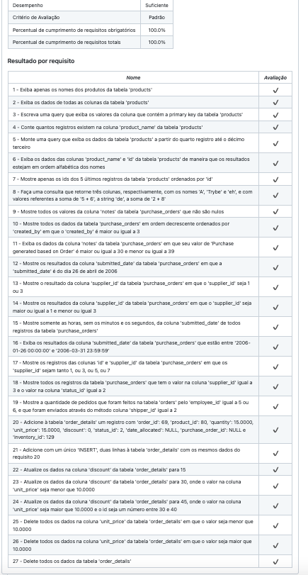

# MySQL All For One - Back-End Project

Nesse projeto manipulamos e acessamos dados de um banco já implementado com queries SQL.

Projeto 19 da [Trybe](https://wwww.betrybe.com), módulo de Back-End.


## O Projeto

#### Queries:
   - Buscando (`SELECT`), inserindo (`INSERT INTO`), atualizando (`UPDATE`...`SET`) e deletando (`DELETE`) na tabela MySQL.
   - Realizando operações com `+ `, `-`, entre outros e contando com `COUNT`
   - Queries com `WHERE`, `ORDER BY`, `LIMIT`e `DESC`, entre outros.

## Instalação 

#### 1- Clonar o repositório

```git clone git@github.com:sallybdiament/Project-19-MySQL-All-For-One.git```

#### 2 - Subir os containers `node` e `db` utilizando o docker-compose

Na raíz do projeto: ```docker-compose up -d```

#### 3 - Abrir o terminal do container `all_for_one`

```docker exec -it all_for_one bash```

#### 4 - Instalar as dependências

No terminal do container: ```npm install```

#### \*Foi utilizado o MySQL Workbench para visualizar as tabelas e as queries.\*

## Tecnologias
 - SQL
 - Docker CLI
